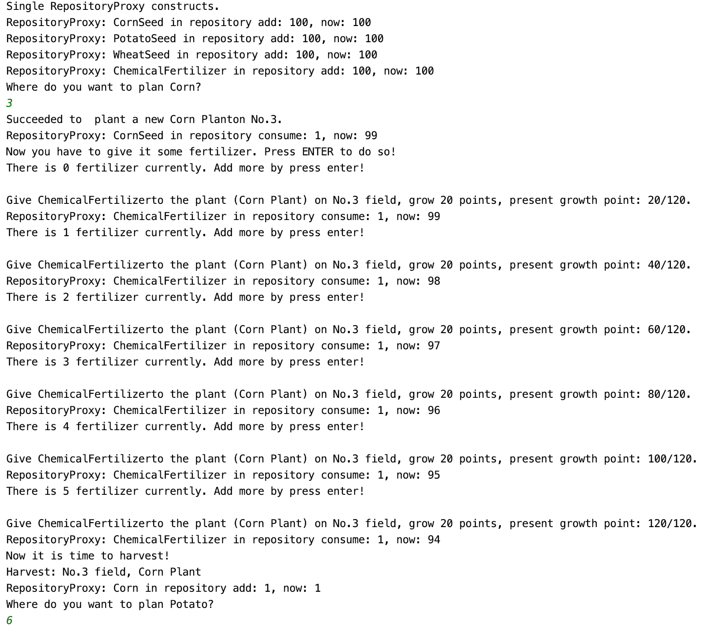

# Command 模式测试

### 测试逻辑合理性

在完成农田与仓库交互的时候，采用 Command 设计模式。当调用 seeding(), giveFertilizer() 等方法 时， StockManager 执行 FarmManager 的命令，询问数量，并在成功后将其减一，在 harvest() 调用时则 将果实加一。 

考虑到 Command 模式在延迟执行以及消除重复代码等方面的突出作用，我们采用了用户交互的方式来对这个设计模式进行测试。我们允许用户来选择究竟要把种子种到哪一块田地上面去，并且要求用户自己来施肥，从而帮助用户体会 command 设计模式的优越性。

### 测试用例正确性

经过我们的测试，该小组所设置的 Command 模式表现良好，能够充分的体现出 Command 模式在构造对象这种操作上的优越性。

美中不足的是，该组并且明确的实现 Undo Command。

### 重写测试

我们首先邀请用户来输入每一种具体的植物种植在哪里，然后邀请用户来给它们施肥，最终收获它们。

```java
public class CommandTest {
  public static void main(String[] args) throws ClassNotFoundException {
     /**
       * @description: do some seeding first, then do some harvesting {corn, potato, wheat}
       *
       * @param args :
       *
       * @return : void
       **/
    RepositoryProxy.Instance().add(CornSeed.class, 100);
    RepositoryProxy.Instance().add(PotatoSeed.class, 100);
    RepositoryProxy.Instance().add(WheatSeed.class, 100);
    RepositoryProxy.Instance().add(ChemicalFertilizer.class, 100);
    FarmManager farmManager = FarmManager.getInstance();
    String[] seedList = new String[]{"Corn", "Potato","Wheat"};
    Scanner scanner = new Scanner(System.in);
    int[] matureCount = {6,5,4};
    for (int i =0;i<seedList.length;i++) {
      System.out.println("Where do you want to plan " + seedList[i] +"?");
      String indexStr = scanner.nextLine();
      int index;
      try {
        index = Integer.parseInt(indexStr);
      }catch (NumberFormatException e){
        index = 0;
      }
      // This group is good at using Class object, we have to learn from them.
      farmManager.seeding(Class.forName("com.shop.employee."+seedList[i]+"Seed"),index);
      System.out.println("Now you have to give it some fertilizer. Press ENTER to do so!");
      int fertilizerCount = 0;
      do {
        System.out.println("There is " + fertilizerCount+" fertilizer currently. Add more by press enter!");
        scanner.nextLine();
        farmManager.giveFertilizer(index,ChemicalFertilizer.class);
        fertilizerCount++;
      }while (fertilizerCount<matureCount[i]);
      System.out.println("Now it is time to harvest!");
      farmManager.harvest(index);
    }
  }
}
```


### 测试结果




### 评分

| 设计模式 | Class/Interface API                                          | framework完成分（70） | Sample program完成度（30） | 备注说明                                                  |
| -------- | ------------------------------------------------------------ | --------------------- | -------------------------- | --------------------------------------------------------- |
| Command  | Command, AddItemCommand, QueryItemCommand, ShowAllCommand, DelItemCommand | 68                    | 30                         | 用例情节合理，设计模式实现良好。可惜没有实现 undo command |

