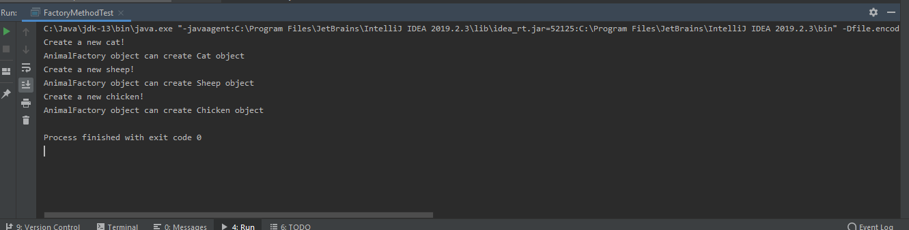

### 测试逻辑合理性

 	工厂方法模式通过定义工厂父类负责定义创建对象的公共接口，而子类则负责生成具体的对象。 作为测试，我们先观察是否有一个工厂父类和一个待创建对象的父类，然后对继承自待创建对象父类的子类，是否有一个继承自工厂父类的工厂子类负责创建它。

### 测试用例正确性

​	这里在对方小组中，待创建对象的对象父类是 Animal，分别有 Cat、Sheep、Chicken 三个子类，然而自由一个工厂类 AnimalFactory，所以我们只能测试该工厂类能否根据所给的参数创建Animal的子类。

### 重写测试（逻辑说明+代码）

​	按照对方小组的设计，我们先示例化一个 AnimalFactory 对象，然后分别传入“Cat”、"Chicken"、"Sheep"，如果能得到对应的对象，那说明这个 AnimalFactory 可以根据参数创建不同的Animal子类对象。但是不符合侯老师所介绍的工厂方法模式。

```java
public class FactoryMethodTest {
    public static void main(String[] args){
        AnimalFactory animalFactory = new AnimalFactory();
        if(animalFactory.run("Cat") instanceof Cat){
            System.out.println("AnimalFactory object can create Cat object");
        }else {
            System.out.println("AnimalFactory object can't create Cat object");
        }
        if(animalFactory.run("Sheep") instanceof Sheep){
            System.out.println("AnimalFactory object can create Sheep object");
        }else {
            System.out.println("AnimalFactory object can't create Cat object");
        }
        if(animalFactory.run("Chicken") instanceof Chicken){
            System.out.println("AnimalFactory object can create Chicken object");
        }else {
            System.out.println("AnimalFactory object can't create Cat object");
        }
    }
}
```


### 测试结果（截图）




### 评分

| 设计模式       | Class/Interface API                        | framework完成分（70） | Sample program完成度（30） | 备注说明                                                     |
| -------------- | ------------------------------------------ | --------------------- | -------------------------- | ------------------------------------------------------------ |
| Factory Method | AnimalFactory、Animal、Chicken、Sheep、Cat | 60                    | 30                         | 该组运用工厂模式的时候只有一个工厂类，没有工厂父类和对应每个待创建对象的工厂子类，和侯老师介绍的工厂方法模式有出入，违背了OCP原则，但是也能实现功能，所以完成分我们给出60。 |
