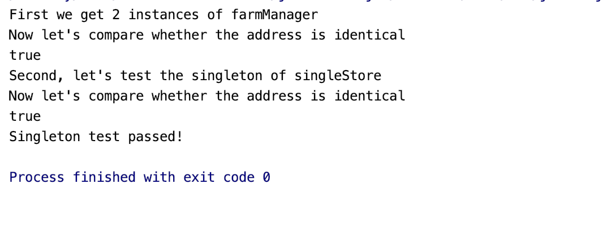

# Singleton 模式测试

### 测试逻辑合理性

单例模式是为了保证在整个程序运行过程中某个类只能拥有一个实例化的对象，从而保证程序的正确运
行。我们将仓库代理设计为单例，将仓库代理的构造函数设计为私有方法。获取唯一的仓库代理实例只能通 过静态公有的Instance()方法。 在RepositoryProxy类的构造函数中输出信息，确保当类被构造时能够被知晓。连续两次调用 RepositoryProxy.Instance()来展示单例对象的构造过程 

考虑到单例模式的特殊性质，我们不设置交互式的设计，而是去测试该小组所创建的对象是否是处在相同的地址上。Java 中的 == 运算符对于类类型都是直接比较地址的，正合适我们的使用。

### 测试用例正确性

经过我们的测试，该小组所设置的 Singleton 模式表现良好，能够充分的体现出该模式在构造对象这种操作上的优越性。

### 重写测试

我们获取两次对象，再检查这两个对象的地址是否是一致的。

```java
public class SingletonTest {
  public static void main(String[] args){
     /**
       * @description: Just call some constructor and see whether the object is constructed only once
       *
       * @param args :
       *
       * @return : void
       **/

    System.out.println("First we get 2 instances of farmManager");
    FarmManager farmManager = FarmManager.getInstance();
    FarmManager farmManager1 = FarmManager.getInstance();
    System.out.println("Now let's compare whether the address is identical");
    boolean farmTest = farmManager==farmManager1;
    System.out.println(farmTest);
    System.out.println("Second, let's test the singleton of singleStore");
    SingleStore singleStore = SingleStore.getSingleStore();
    SingleStore singleStore1 = SingleStore.getSingleStore();
    System.out.println("Now let's compare whether the address is identical");
    boolean storeTest = singleStore==singleStore1;
    System.out.println(storeTest);
    if(farmTest && storeTest){
      System.out.println("Singleton test passed!");
    }else {
      System.out.println("Singleton test failed!");
    }
  }
}
```


### 测试结果



### 评分

| 设计模式  | Class/Interface API     | framework完成分（70） | Sample program完成度（30） | 备注说明                       |
| --------- | ----------------------- | --------------------- | -------------------------- | ------------------------------ |
| Singleton | FarmManager,SingleStore | 70                    | 30                         | 用例情节合理，设计模式实现良好 |

