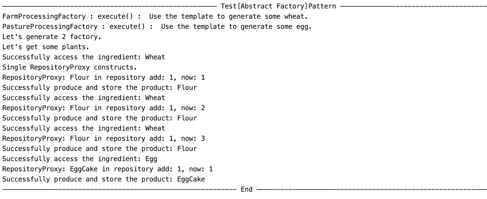

# Template Method 模式测试

### 测试逻辑合理性

在模板模式中，一个抽象类公开定义了执行它的方法的方式/模板。它的子类可以按需要重写方法实现，但调用将以抽象类中定义的方式进行。 在测试中，农场加工厂和牧场加工厂共同继承了加工产品的模板，但各自重写了加工产品的各个步骤。 分别调用农场加工厂和牧场加工厂的生产商品的方法，验证农场加工厂和牧场加工厂实现了加工不同产品的功能。 

根据该组的实现，我们构造了拥有模版方法的两个类，他们都是 Produce 类的子类，分别是 FarmProcessingFactory 以及 PastureProcessingFactory。而后我们调用了它的 execute 方法，该方法内部就是一个 template method。

### 测试用例正确性

经过我们的测试，该小组所设置的 Template Method 模式表现良好，能够充分的体现出 Template Method 模式在构造对象这种操作上的优越性。

### 重写测试

我们首先邀请用户来输入每一种具体的商品要多少，然后根据用户的输入来构造响应的订单。

```java
public class TemplateMethodTest {
  public static void main(String[] args){
    System.out.println("------------———— Test[Abstract Factory]Pattern ————————————-————");
    System.out.println("FarmProcessingFactory : execute() :  Use the template to generate some wheat.");
    System.out.println("PastureProcessingFactory : execute() :  Use the template to generate some egg.");
    System.out.println("Let's generate 2 factory.");
    FarmProcessingFactory farmProcessingFactory = new FarmProcessingFactory();
    PastureProcessingFactory pastureProcessingFactory = new PastureProcessingFactory();
    System.out.println("Let's get some plants.");
    farmProcessingFactory.execute();
    farmProcessingFactory.execute();
    farmProcessingFactory.execute();
    pastureProcessingFactory.execute();
    System.out.println("———————————----------- End ————----------------------------————");
  }
}
```


### 测试结果




### 评分

| 设计模式        | Class/Interface API                             | framework完成分（70） | Sample program完成度（30） | 备注说明                       |
| --------------- | ----------------------------------------------- | --------------------- | -------------------------- | ------------------------------ |
| Template Method | FarmProcessingFactory, PastureProcessingFactory | 70                    | 30                         | 用例情节合理，设计模式实现良好 |

